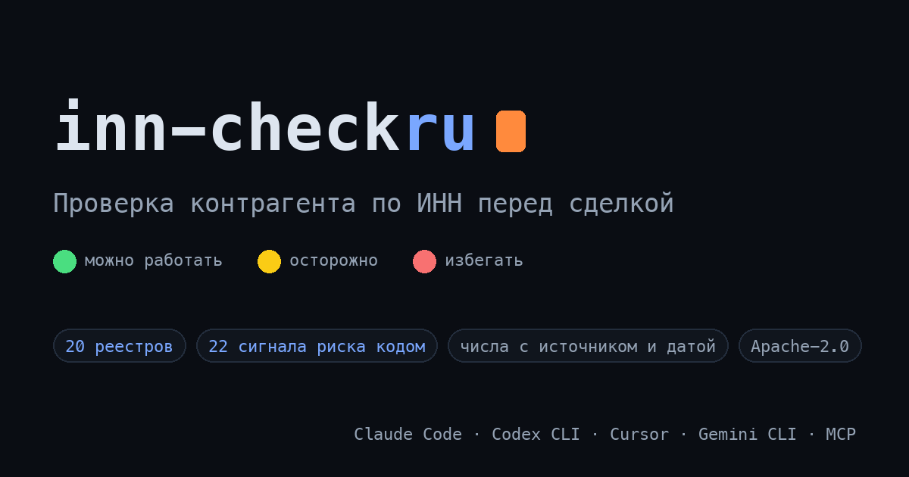

# inn-check-ru: проверка контрагента по ИНН в AI-агенте

> 🇬🇧 [English version](README.en.md)

> **Не отгружай в долг вслепую.** Открытый AI-скилл, который по одному ИНН собирает открытые реестры (ЕГРЮЛ, ФССП, суды, банкротства, финансы) и выдаёт **светофор риска 🟢/🟡/🔴** с рекомендацией: отсрочка, только предоплата или избегать. Для Claude Code, Cursor, Codex, ChatGPT и Gemini. Бесплатно, Apache-2.0, данные — из настоящих реестров, а не из головы модели.

[](LICENSE)
[](CHANGELOG.md)
[](https://github.com/ilyautov/inn-check-ru/stargazers)
[](https://skills.sh/ilyautov/inn-check-ru/inn-check-ru)

<p align="center">
  <a href="https://inn-check-ru.aifrontier.tech/">
    
  </a>
</p>

📖 **Сайт проекта:** [inn-check-ru.aifrontier.tech](https://inn-check-ru.aifrontier.tech/) — разборы по кластерам: [проверка по ИНН](https://inn-check-ru.aifrontier.tech/proverit-kontragenta-po-inn.html), [ИП](https://inn-check-ru.aifrontier.tech/proverka-ip-po-inn.html), [однодневки](https://inn-check-ru.aifrontier.tech/priznaki-odnodnevki.html), [дробление](https://inn-check-ru.aifrontier.tech/droblenie-biznesa.html), [мониторинг](https://inn-check-ru.aifrontier.tech/monitoring-kontragentov.html).

```
🚦 ООО «Ромашка», ИНН 7700000000 — на 15.06.2026

🔴 Отсрочку не давать. Только 100% предоплата или отказ.

Почему: компания в стадии ликвидации; 4 исп. производства ФССП на 3,1 млн ₽ — больше суммы сделки.
Уровень поднят сигналами: ликвидация (ЕГРЮЛ) + ФССП 3,1 млн > сумма сделки 1,2 млн.
Рекомендация: избегать отсрочки; при острой нужде — только предоплата.
Вердикт сменится, если: ликвидация отменена И производства погашены (🔴→🟡).
Мониторить: банкротное заявление в ЕФРСБ.
Что проверено: ЕГРЮЛ ✅, ФССП ✅ (15.06.2026). Что НЕ проверено: суды (kad.arbitr — вручную).
```
*(Пример иллюстративный, данные условные. Так выглядит ответ за пару минут quick-scan.)*

**Быстрый старт** (Claude Code, Cursor, Codex и др.):

```bash
npx skills add ilyautov/inn-check-ru
```

Затем просто скажите агенту: **«проверь поставщика по ИНН 7700000000 перед предоплатой»**.

## Зачем это нужно

Каждый, кто торгует в долг или платит предоплату, знает эту историю: контрагент оказался в банкротстве, директор дисквалифицирован, а компания «в стадии ликвидации» уже полгода. Всё это было **открыто до сделки** — в ЕГРЮЛ, ФССП, картотеке арбитража, ЕФРСБ. Просто никто не свёл это в одну картину за те пять минут, что есть у собственника.

«Проверить контрагента по ИНН» — один из самых массовых деловых запросов в рунете. Сервисов много, но у них общая болезнь, которую мы измерили вживую:

> **Живой тест (15.06.2026).** Одна компания, 5 бесплатных агрегаторов. Число судебных дел разошлось почти втрое: примерно ~500 / ~1000 / ~1500 — у каждого своя методология подсчёта. Один агрегатор вдобавок подмешал чужие банкротные «намерения». Зато выручка и число исполнительных производств совпали у всех.

Отсюда главный принцип скилла: **одиночному агрегатору верить нельзя — счётчики врут уверенно. Факт — это то, что совпало у ≥3 источников; расхождение — флаг, а не повод выбрать самую красивую цифру.**

## Как это работает

**Двухскоростная проверка.** Сначала quick-scan (пара минут): только deal-killer-сигналы — ликвидация, банкротство, недостоверность ЕГРЮЛ, дисквалификация директора, долги крупнее суммы сделки. Нашёлся хоть один — 🔴, дальше можно не собирать: ~70% отсева происходит здесь. Чисто — полное досье по каскаду источников.

**Источники — по каскаду дешевизны:** бесплатные скрипты ФНС (ЕГРЮЛ, Прозрачный бизнес, ГИР БО, ✅ Реестр МСП, НПД, ЕРКНМ/РНП, спецреестры — без ключей, `scripts/fetch_counterparty.py`) → ФССП и суды через браузер/агрегаторы (checko, list-org, СБИС, audit-it, rusprofile — все без капчи и регистрации; официальный API ФССП отключён с 2022) → ручной ввод как последняя опция.

**Быстро отсеивает и не тратит время зря.** Быстрая фаза (ЕГРЮЛ, риск-флаги ФНС, реестр дисквалифицированных, санкционные перечни) собирается параллельно за 2–4 секунды. Нашёлся deal-killer — досье не собирается вовсе: `--режим quick|полный|всё` и блок `_сбор` в выводе показывают, где проверка остановилась и почему. Режим `всё` отключает ранний выход для снимков мониторинга.

**Батч по базе контрагентов.** `scripts/batch_check.py контрагенты.csv --профиль отсрочка` — таблица со светофорами, наверху опасное и непроверенное, дубли схлопнуты, невалидные ИНН не потеряны, `--продолжить` переживает обрыв и перепроверяет только то, что не проверилось.

**Мониторинг с расписанием.** `scripts/watchlist.py --добавить <ИНН>`, `--прогон` по списку, `--только-изменения` для крона. Снимки хранятся отпечатками: поля диффа, состояния источников и хеш остального — в пять раз меньше и без лишних чужих персданных. `--установить-расписание` печатает готовые строки crontab и launchd, но ничего не ставит само.

**Три состояния вместо «чисто».** Каждый источник в выводе — `ok` (ответил, контракт полей совпал), `пусто` (ответил, записи по ИНН нет — это факт) или `не проверено` (сеть, гео, капча, схема изменилась, не покрыто скриптом). Парсеры проверяются против записанных ответов ФНС, а не угаданных имён полей (`eval/run_fetch_eval.py` + тест дрейфа схемы); канарейки — эталонные ИНН из реестра `scripts/sources.py` — отличают «данных нет» от «парсер сломан». Блок `_итог_проверки` считает долю непроверенных deal-killer-источников: больше половины — «проверка не состоялась», и 🟢 не выдаётся. Когда парсер ломается, продукт говорит «не проверено», а не «чисто».

**Сеть — параметр, а не стена.** `scripts/check_access.py` за десять секунд показывает, что доступно с вашей сети (доступен / tls / гео / dns / капча), кеширует результат на сутки, и движок сразу помечает заблокированное «не проверено», не съедая дедлайн. TLS-ошибки fedsfm.ru и rosstat.gov.ru лечит `scripts/install_ca.py` — корень УЦ Минцифры с проверкой отпечатков, верификация не отключается; гео-блок — РФ-IP или `HTTPS_PROXY`. Добавить источник — одна запись в `sources.py`, одна функция и фикстура.

**Цель проверки задаёт вес фактов.** Одиннадцать профилей в `data/profiles_ru.json` (`нейтрально` по умолчанию, `отсрочка`, `предоплата`, `получаю_предоплату`, `подрядчик`, `тендер`, `цепочка_поставки`, `доля`, `клиент_115фз`, `самопроверка`, `ндс_вычет`): отрицательные чистые активы — стоп для отгрузки в долг и аргумент в торге при покупке доли. Светофор и рекомендацию считает `scripts/profiles.py` из собранного JSON, только вверх по тревожности; без названной цели — карточка фактов без вердикта. Там, где вердикт по одному ИНН был бы подменой (цепочка поставки — вопрос про 2-3 звена), профиль светофор не выдаёт намеренно. `fetch_counterparty.py <ИНН> --профиль отсрочка` собирает только то, что влияет на вердикт в этом профиле.

**ИП — отдельный светофор.** По 12-значному ИНН скилл сам переключается на контур ИП: статус в ЕГРИП, самозанятость (НПД), спецрежим и численность, МСП (исключение из реестра — стоп-сигнал), внесудебное банкротство физлиц, два поиска ФССП (по ИНН и по ФИО). Что закрыто законом (выручка, налоговый долг, адрес ИП) — честно «не проверено», а не правдоподобная выдумка.

**Финансовый профиль — кодом, а не из головы модели.** `scripts/fin_scoring.py` считает из строк отчётности ГИР БО: чистые активы два года подряд ниже нуля (ст. 30 ФЗ-14 — риск обязательной ликвидации, 🔴 deal-killer), автономию, ликвидность, падение выручки, транзитный профиль (рост >300% при нулевой численности). Каждый флаг трассируется к сырой строке баланса; где строки нет — честное «не проверено». Логика проверяется офлайн-eval'ом на синтетических фикстурах (`eval/run_fin_eval.py`).

**Санкционный контур — офлайн, три списка.** `scripts/sanctions_check.py` сверяет директора и компанию локально за секунды с перечнем Росфинмониторинга, OFAC SDN (США) и EU Consolidated list (ЕС) — каждый скачивается один раз в кэш и обновляется независимо. Совпадение в списках ЕС/США для экспортной сделки — отдельный риск вторичных санкций и валютных платежей. Плюс чеклист однодневки по методике ФНС из уже собранных сигналов (3+ признака → 🟡, 5+ → 🔴) и ранние сигналы ликвидации из Вестника госрегистрации и Федресурса — они попадают в ЕГРЮЛ с опозданием в недели.

**Мониторинг — механика, а не обещание.** `fetch_counterparty.py <ИНН> --save` сохраняет снимок проверки перед каждой крупной отгрузкой; `diff_counterparty.py <ИНН>` сравнивает два последних снимка и показывает, что изменилось: смена статуса на ликвидацию 🔴, новый директор 🟡, недостоверность сведений 🔴, ухудшение финансов по порогам скоринга — всё офлайн, с датами «было/стало», в JSON или светофорной карточкой (`--human`).

**Граф связей и признаки дробления — кодом.** `affiliates_graph.py <ИНН>` (бесплатный ключ checko) строит граф глубины 2 **ленивым обходом** — с бюджетом запросов, остановкой на первом значимом сигнале (ликвидация у связанной компании — это уже ответ) и на пересечении с уже проверенными (`--известные`): общие директора и учредители, соседи по адресу, правопреемство. Инструмент, выкачавший полсотни компаний на вопрос «кто за поставщиком», задаёт вопрос «зачем» — поэтому в выводе видно, сколько запросов потрачено и где обход остановлен, а неразвёрнутые связи идут в «не проверено», а не исчезают. Рёбра честно помечаются как «⚠️ один источник, требует пересечения», а ключ ускоряет, но не обязателен — связи можно собрать браузером и подать через `--offline-граф`. `droblenie_check.py` считает по графу чеклист из методики ФНС: общий директор/адрес/ОКВЭД, все на УСН, каждая компания под порогом освобождения от НДС — а группа в сумме над ним. Пороги живут в версионируемом каноне `data/canon_ru.json` — каждое число с цитатой первоисточника и датой проверки. Вывод — всегда «N признаков, совпадающих с типовыми доводами ФНС по спорам о дроблении», никогда «это дробление»: суды прямо говорят, что аффилированность сама по себе ничего не доказывает.

**Отраслевая норма вместо абсолютных цифр.** «Выручка 40 млн» сама по себе не значит ничего: для розничного магазина это середина, для строителя — нижний дециль. `scripts/benchmarks.py --инн ... --оквэд ... --регион ... --выручка ...` кладёт компанию в перцентиль своей группы (ОКВЭД2 × регион × размер) — таблица из 5480 групп собрана из открытых дампов ФНС (`scripts/opendata_refresh.py`) и едет с пакетом. Где группа мала или смещена, скрипт не сравнивает, а говорит об этом: группы «среднее» и «крупное» собраны только по субъектам реестра МСП, поэтому норма для большой компании — не норма отрасли, и вывод помечается предупреждением, а не перцентилем. Каждая метрика несёт собственный счётчик наблюдений: `n_ссч`, `n_нагрузка`, `n_ндс_к_выручке` — медиана по 14 компаниям и по 600 в выводе не выглядят одинаково.

**Дампы ФНС ищутся по ИНН, а не только разворачиваются в норму.** `scripts/opendata_index.py --построить` один раз строит локальный индекс поверх уже скачанных выгрузок (`opendata_refresh.py`), а `--найти 2309085638` отдаёт по ИНН среднесписочную численность, применяемые спецрежимы и суммы уплаченных налогов — то, что в «Прозрачном бизнесе» сидит за детальным эндпоинтом и с не-РФ IP недоступно. Индекс — отсортированный бинарный файл с двоичным поиском на диске, без БД и без зависимостей: 6 млн записей, ответ за миллисекунды. Главное здесь не скорость, а третье состояние: **«нет записи» — это не «нет сотрудников» и не «на ОСНО»**. Дампы покрывают не всех (`snr` — 52% компаний, `sshr` — 99%, `paytax` — 100% по выборке сдающих отчётность), и оговорка про охват едет в ответе вместе со значением, как и дата выгрузки: сведения ДАТИРОВАНЫ, а не «текущие». Без индекса — честное «не проверено» с причиной `кэш:`, а не ноль.

**Признаки «бумажного» НДС — языком фактов.** `scripts/paper_vat.py --stdin` (или по файлу сбора) считает из уже собранных данных то, из-за чего снимают вычет: возраст компании, массовый адрес, нераскрытая численность, разрыв между заявленным предметом сделки и ОКВЭД, спецрежим против выставленного НДС, выручка на сотрудника далеко за отраслевой нормой. Инструмент **не выносит налоговых заключений** и не пишет «вычет не устоит»: по п. 3 ст. 54.1 НК РФ нарушение контрагента само по себе не основание. Он пишет, что видно, чего не видно (разрывы АСК НДС-2 и книги покупок закрыты) и что можно проверить самому. Банк, страховщик, ИП и участник КГН отчётность в ГИР БО не сдают по закону — отсутствие строк у них не признак, а «не применимо»: до этой проверки скрипт выписывал признак технической компании ПАО «Сбербанк».

**Вердикт на дату в прошлом.** `scripts/retro_verdict.py <ИНН> --дата 2026-03-01 --профиль отсрочка` считает светофор по снимку, сохранённому ТОГДА — потому что должная осмотрительность доказывается тем, что было видно ДО сделки, а не сегодняшней карточкой. Снимок новее запрошенной даты не берётся (это данные из будущего), из сети ничего не добирается (прошлое не переспрашивается), а «значения не сохранены» не превращается в «признака не было»: такие сигналы остаются «не проверено», и 🟢 по ним не выдаётся. В выводе — дата снимка, отставание от запрошенной даты в днях, чем снимок собирался и что именно не восстановилось. Снимков на дату нет — честный отказ: задним числом проверка не появляется.

**Досье осмотрительности — документ, а не светофор.** `scripts/dossier.py --fetch a.json --профиль отсрочка --предмет "поставка ГСМ" --сумма 4200000` собирает Markdown (или `--docx`), который фиксирует, что было видно в открытых источниках на дату и время проверки — с хешем исходного JSON в шапке и отдельным разделом о границах документа. Юридическая ценность такого документа процедурная и появляется, только если он составлен **до** сделки. Ни гербов, ни «справка выдана»: это отчёт инструмента, и подписан он так же. Источник, о котором во входных данных нет сведений, попадает в досье как «сведений во входе нет», а не как «ответил».

**Проверка без запроса.** `scripts/extract_inn.py счёт.txt договор.html выгрузка.csv` вынимает ИНН из документа: HTML с атрибутами (в карточке ЕГРЮЛ и веб-1С ИНН лежит именно в `value`), письмо `.eml` с base64, JSON с путём до поля, CSV. Мусор режется контрольным числом ФНС. `--только-новые` отсеивает уже проверенное, `--проверить --профиль отсрочка` уводит остальное в `batch_check.py --режим quick` — и человек узнаёт о 🔴 до оплаты, ни о чём не спрашивая. Сеть без `--проверить` не трогается вовсе.

**Выдача — светофор, а не простыня** (полный пример — в шапке страницы).

**Каждая цифра — с источником, датой и tier-маркером** (✅ подтверждено / ⚠️ один источник / ❌ не подтверждено). Где данных нет, скилл пишет «не проверено» вместо правдоподобной выдумки. Светофор — оценка для собственника, а не приговор контрагенту: решение всегда за вами.

## Установка

### Через skills.sh (любой агент)

```bash
npx skills add ilyautov/inn-check-ru
```

CLI [skills.sh](https://skills.sh) ставит скилл в каталог вашего агента (Claude Code, Cursor, Codex, Gemini CLI и др.).

### Claude Code (плагин)

```text
/plugin marketplace add ilyautov/inn-check-ru
/plugin install inn-check-ru@inn-check-ru
```

### Claude.ai (веб)

Готовый ZIP последнего релиза (собирается CI из тега, `SKILL.md` в корне архива):

**[Скачать inn-check-ru.zip](https://github.com/ilyautov/inn-check-ru/releases/latest/download/inn-check-ru.zip)**

Settings → Capabilities → Skills → Upload skill.

Запасной путь вручную:

```bash
git clone --depth 1 https://github.com/ilyautov/inn-check-ru
cd inn-check-ru && python3 scripts/build_release_zip.py
```

### Вручную (GitHub Copilot, Cline, Roo Code, Goose, OpenCode)

Скопируйте `SKILL.md`, папки `references/` и `scripts/` в каталог скиллов вашего агента (например `.agents/skills/inn-check-ru/`) и перезапустите его. `references/` — вынесенные разделы скилла, которые агент читает по поводу: без них он потеряет ветку ИП, мониторинг и батч молча.

## Использование

По-русски, обычными словами:

```
проверь контрагента по ИНН 7700000000 перед отгрузкой
надёжный ли это поставщик, дать ли отсрочку 30 дней
не однодневка ли эта компания
сверь этого клиента по реестрам, хочет 5 млн в долг
```

Полное досье — по запросу «разверни карточку». Мониторинг изменений (новый иск, банкротство, смена директора) — «поставь на мониторинг».

## Два интерфейса

Один движок (`scripts/`, чистый stdlib), две обёртки:

- **Скилл (`SKILL.md` + `references/`)** — методология для агента: двухскоростной флоу, каскад источников, светофор, мониторинг. Основной файл читается целиком при каждом запуске, справочное лежит рядом и открывается по поводу. Когда проверка — часть живого разговора («проверь этого поставщика перед предоплатой»).
- **MCP-сервер (`mcp/`)** — те же скрипты как 14 read-only инструментов MCP-сессии. Когда проверка — шаг в цепочке инструментов: счёт из diadoc-mcp-ru → `counterparty_fetch` до подписи. Tier-маркеры и «не проверено» проезжают в ответах как есть. Установка и конфиги: [mcp/README.md](mcp/README.md).

## Чем отличается от Контур.Фокуса, Checko и других сервисов

Не заменяет их, а решает другую задачу:

- **Сводит несколько источников** и показывает расхождения вместо одной уверенной цифры — потому что счётчики агрегаторов не совпадают (см. живой тест выше).
- **Живёт внутри вашего AI-агента** — в связке с остальной работой: счёт пришёл в переписке → проверка → черновик ответа клиенту.
- **Открытый код**: пороги светофора видны и настраиваются, логику можно проверить, а не верить чёрному ящику скоринга.

## Чем это не является

Оценка риска по открытым данным, а не юридическая или кредитная гарантия. Для крупной или необратимой сделки светофор — рабочий лист для юриста и финансового аналитика, не последнее слово. Чего скилл **не умеет** — честно и по пунктам: [KNOWN_LIMITS.md](KNOWN_LIMITS.md).

## Часто ищут

**Как проверить контрагента по ИНН бесплатно?** Этот скилл: ИНН → светофор риска с причиной и рекомендацией за пару минут, по открытым реестрам ФНС/ФССП/арбитража/ЕФРСБ.

**Как проверить ИП по ИНН?** Тем же способом, но контур другой — ЕГРИП, статус самозанятого (НПД), МСП, спецрежим, два поиска ФССП (по ИНН и по ФИО), внесудебное банкротство физлиц. Выручки и налогового долга у ИП нет в открытых данных — закон, не баг.

**Как проверить директора и доверенность подписанта?** Директор сверяется по перечню Росфинмониторинга офлайн (`scripts/sanctions_check.py`) и по реестру дисквалифицированных лиц; если договор подписывает не директор, а человек по доверенности — перед подписанием проверьте номер машиночитаемой доверенности (МЧД) в реестре ФНС (m4d.nalog.gov.ru): отозванная доверенность обесценивает подпись.

**Работает без API-ключей?** Базовый контур (ЕГРЮЛ, риск-флаги ФНС, финансы, МСП, НПД, агрегаторы) — да, без ключей и регистраций. Граф связей — бесплатный ключ checko (или браузер), суды/банкротства/ФССП глубже — через браузер.

**Куда уходят мои данные?** Скилл — инструкция для вашего агента; он работает там, где работает ваш Claude или Cursor. TLS-проверка в скриптах включена по умолчанию; корень УЦ Минцифры ставится `scripts/install_ca.py` с проверкой отпечатков, верификация не отключается. Что и куда отправлять — решаете вы.

## Проверка, вклад, безопасность

- **CI.** Ruff + проверка frontmatter скилла на каждый PR.
- **Как помочь.** Багрепорты, расхождения цифр с реестрами, новые источники: [CONTRIBUTING.md](CONTRIBUTING.md).
- **Безопасность.** Модель угроз, TLS по умолчанию, как сообщить об уязвимости: [SECURITY.md](SECURITY.md).

## Лицензия

Apache-2.0 ([LICENSE](LICENSE)). Выделено из [small-business-ru](https://github.com/ilyautov/small-business-ru) — 34 скилла операционки малого бизнеса РФ: налоги УСН, дебиторка, маржа, найм.

---

**inn-check-ru** — открытый AI-скилл для проверки контрагента по ИНН: светофор риска 🟢/🟡/🔴 по реестрам ЕГРЮЛ, ФССП, картотеки арбитража и ЕФРСБ. Бесплатный open-source для Claude Code, Cursor, Codex, ChatGPT и Gemini. Факт — то, что совпало у трёх источников.

---

## Кто это сделал

[Илья Утов](https://github.com/ilyautov), лаборатория [AI Frontier](https://aifrontier.tech). Как эти инструменты устроены внутри, пишу в [Telegram](https://t.me/gorilla_under_hood).

**Рядом стоят:** [small-business-ru](https://github.com/ilyautov/small-business-ru) (34 скилла для МСБ) · [humanizer-ru](https://github.com/ilyautov/humanizer-ru) (очеловечить русский AI-текст) · [marketplaces-mcp-ru](https://github.com/ilyautov/marketplaces-mcp-ru) (WB, Ozon, Яндекс Маркет, Авито из агента). Этот скилл есть и MCP-сервером ([mcp/](mcp/README.md)) — проверка как инструмент в цепочке MCP-сессии; готовый ZIP для claude.ai — в [последнем релизе](https://github.com/ilyautov/inn-check-ru/releases/latest/download/inn-check-ru.zip). Пригодилось — поставьте звезду: по ней это находят другие.
